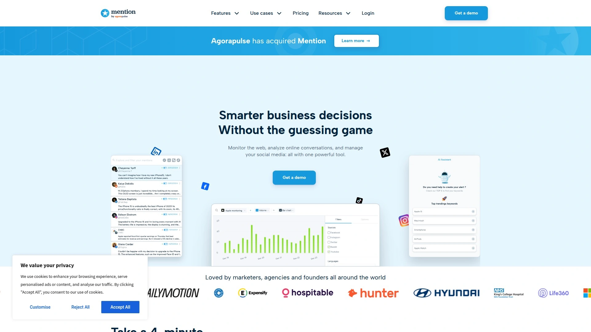

# 最新品牌监测工具盘点（内附多平台对比）

在数字营销与公关场景下，高效的品牌监测工具能帮助企业及时捕捉舆情、优化投放策略，并洞察竞争对手动态。本文精选五大主流品牌监测与社交聆听服务，可覆盖社交媒体、新闻、论坛等多元平台，部署简便、分析深度强，显著提高市场情报收集与危机预警效率。

***

## **[Octolens](https://octolens.com)**
AI驱动的品牌声誉监控工具，专为B2B SaaS团队打造，支持定制化关键词追踪。

- 实时监测Twitter、Reddit、GitHub、LinkedIn等全网舆情，自动推送品牌及竞品相关动态。
- 强化语义分析与优先级评估，帮助用户聚焦最有价值的话题与机会。
- 支持自定义预警，团队可通过邮箱或Slack第一时间获悉重要事件。
- 输出趋势报告，便于高层决策和市场洞察，广泛适合市场部、销售、产品等跨部门协同.

***

## **[Brand24](https://brand24.com)**
业界知名品牌及舆情实时追踪系统，服务多行业企业。

- 支持全网声音抓取，自动分类正负面评价，便于企业及时应对危机。
- 图表与报告易导出，便于评估传播效果与市场声量变化。
- 移动端APP支持，随时随地快速查看动态，适合企业主和市场经理。
- 多档套餐，性价比高，适合各阶段企业扩展使用.

***

## **[Mention](https://mention.com)**
全球领先社交聆听与媒体监测平台，扩展覆盖至影响力分析。

- 可监控逾十亿实时来源，覆盖社交、新闻、论坛、博客等核心渠道。
- 内置影响者挖掘与竞品对比工具，洞察话题和舆论焦点。
- 自定义关键词与平台选择，推送到邮箱或API集成，灵活适合企业及品牌代理机构。
- 可视化报告驱动传播与内容优化.

***

## **[Awario](https://awario.com)**
快速成长的新锐社交与品牌监测解决方案，专注中小企业用户。

- 实时跟踪社交、博客、视频评论等多平台内容，自动汇总并分析情感倾向。
- 支持多语言关键词监控，适合全球市场环境。
- 竞品与行业趋势对比，便于营销团队优化策略。
- 报告下载与定制推送好上手，友好的UI适合新手快速上手.

***

## **[Mentionlytics](https://mentionlytics.com)**
智能社交媒体聆听与品牌分析平台，专业支持多语言及跨区域品牌。

- 将全网谈论自动汇总并分析影响力，支持多地市场同步监控。
- 专为营销机构和公关团队设计，协同效率高，报告类型丰富。
- 实时推送与API集成，适配大型企业多部门作业。
- 贴心客户支持与持续平台迭代.

***

## FAQ 常见问题

**品牌监测工具是否支持多平台同步？**
五大主流工具均支持社交媒体、新闻、论坛等多平台同步监控，关键字可自定义配置，高效汇总信息。

**初创团队如何快速部署？**
建议选用Octolens或Awario等平台，均提供可视化引导与API接入，企业无需代码即可快速上线，预警也能即时推送。

**如何评估监控效果？**
可通过内置趋势报告、舆情分布与危机预警统计等定量化数据，结合团队需求定期优化监控关键词和平台设置。

***

## 总结

本文盘点五大品牌监测工具，结合多平台同步优势与高效舆情洞察力，助企业实现更快预警和精准市场分析。[Octolens](#octolens)凭借AI智能分析与多平台即时推送，尤其适合B2B领域、初创及需快速反应的团队部署。
